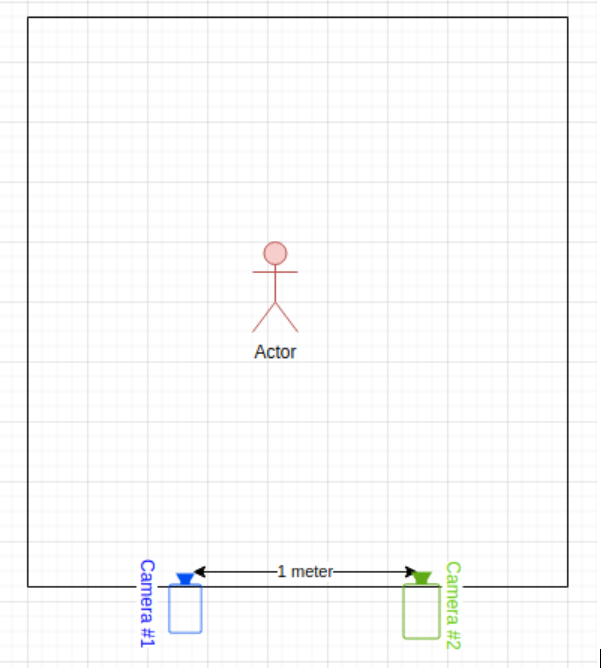
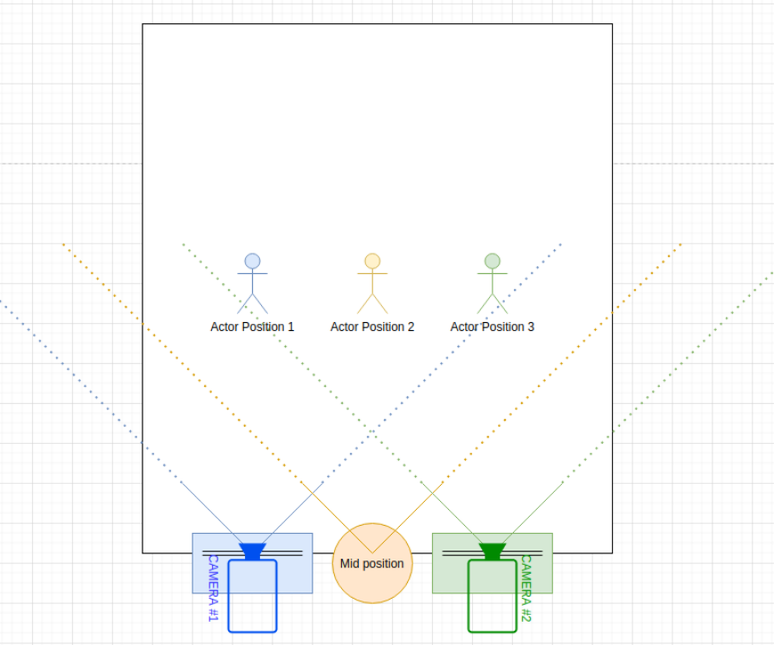
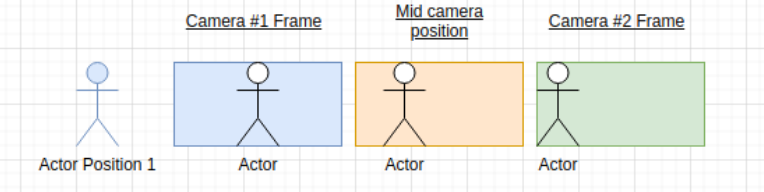
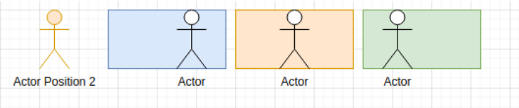
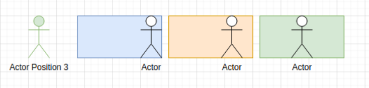

# Photogrammetry  
  
***
## Goals  
  
- Calculate distance to the human actor using coordinates (x;y position of the human face in the frame) from two cameras placed in parallel.  
- Provide single space x;y;z coordinates for the object.  
  
***
## Description   
  
  
Small room with a human actor inside. On one of the walls we have two cameras placed in parallel to each other:  
  
- Distance between the cameras: 1 meter (100.0)  
- Angle of view (AOV) for both cameras: 78° (degrees)  
- Frame width: 2048 px; Frame height: 1080 px.   
  
### Simplified example  
Two cameras (Blue and Green) are observing the Actor movements on the scene:  
  
  
### Observable frames for “Actor position 1” (In-front of the camera #1):  
  
  
Simplified coordinates (for illustrative purposes only):  
> #### Input:  
> Camera #1 coordinates: x:1024 y:540  
> Camera #2 coordinates: x:0 y:540  
> #### Output:  
> Estimate of Mid camera position: x:512 y:540 z: 250  
  
### “Actor position 2” (Between the cameras):  
  
  
### “Actor position 3” (In-front of the camera #2):  
  
  
***
## Delivery  
  
Python or C/C++ script which accepts X;Y coordinates for two cameras and returns the x;y;z single space coordinates (e.g. assuming the mid camera position).  
X - horizontal coordinate;  
Y - Vertical coordinate;  
Z - Depth / Distance to the object.
